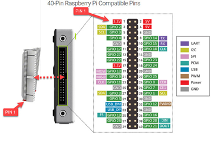

# gpio-led-control


## Getting started
python3 gpioLED.py


## GPIO - LED Control

### 1) Selected PIN Number : 82




### 2) Use Breadboard to Connect LED to Board PIN


## Code

```
import sys
import os

GPIO_EXPORT_PATH = "/sys/class/gpio/export"
GPIO_UNEXPORT_PATH = "/sys/class/gpio/unexport"
GPIO_DIRECTION_PATH_TEMPLATE = "/sys/class/gpio/gpio{}/direction"
GPIO_VALUE_PATH_TEMPLATE = "/sys/class/gpio/gpio{}/value"
GPIO_BASE_PATH_TEMPLATE = "/sys/class/gpio/gpio{}"

def is_gpio_exported(gpio_number):
    gpio_base_path = GPIO_BASE_PATH_TEMPLATE.format(gpio_number)
    return os.path.exists(gpio_base_path)

def export_gpio(gpio_number):
    if not is_gpio_exported(gpio_number):
        try:
            with open(GPIO_EXPORT_PATH, 'w') as export_file:
                export_file.write(str(gpio_number))
        except IOError as e:
            print(f"Error exporting GPIO: {e}")
            sys.exit(1)

def unexport_gpio(gpio_number):
    try:
        with open(GPIO_UNEXPORT_PATH, 'w') as unexport_file:
            unexport_file.write(str(gpio_number))
    except IOError as e:
        print(f"Error unexporting GPIO: {e}")
        sys.exit(1)

def set_gpio_direction(gpio_number, direction):
    gpio_direction_path = GPIO_DIRECTION_PATH_TEMPLATE.format(gpio_number)
    try:
        with open(gpio_direction_path, 'w') as direction_file:
            direction_file.write(direction)
    except IOError as e:
        print(f"Error setting GPIO direction: {e}")
        sys.exit(1)

def set_gpio_value(gpio_number, value):
    gpio_value_path = GPIO_VALUE_PATH_TEMPLATE.format(gpio_number)
    try:
        with open(gpio_value_path, 'w') as value_file:
            value_file.write(str(value))
    except IOError as e:
        print(f"Error setting GPIO value: {e}")
        sys.exit(1)

if __name__ == "__main__":
    if len(sys.argv) != 4:
        print(f"Usage: {sys.argv[0]} <gpio_number> <direction> <value>")
        print(f"Example: {sys.argv[0]} 82 out 1")
        sys.exit(1)

    gpio_number = int(sys.argv[1])
    direction = sys.argv[2]
    value = int(sys.argv[3])

    try:
        # Export the GPIO
        export_gpio(gpio_number)

        # Set GPIO direction
        set_gpio_direction(gpio_number, direction)

        # Set GPIO value
        set_gpio_value(gpio_number, value)
    except KeyboardInterrupt:
        set_gpio_value(gpio_number, 0)
        unexport_gpio(gpio_number)

    print(f"GPIO value: {value}")
    sys.exit(0)
```

## Result
